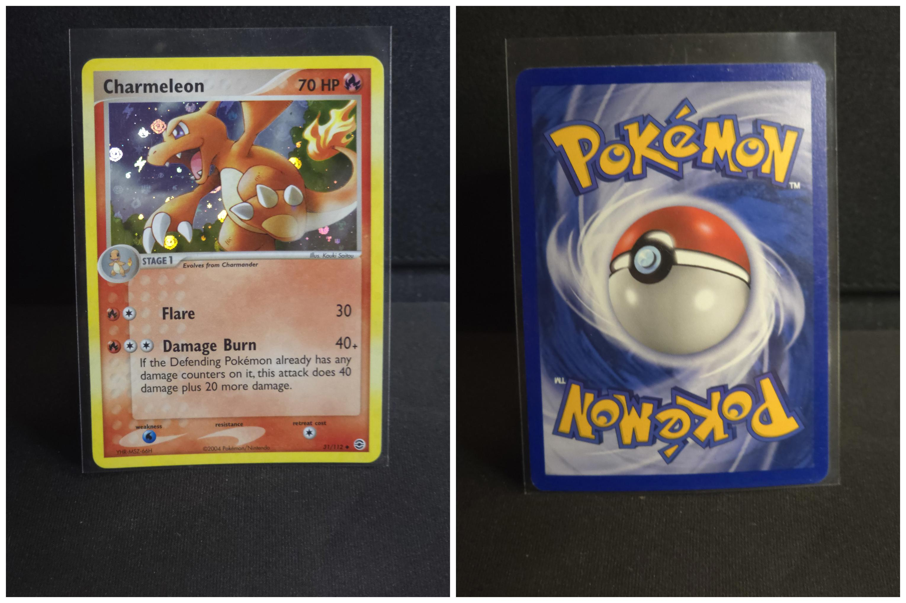
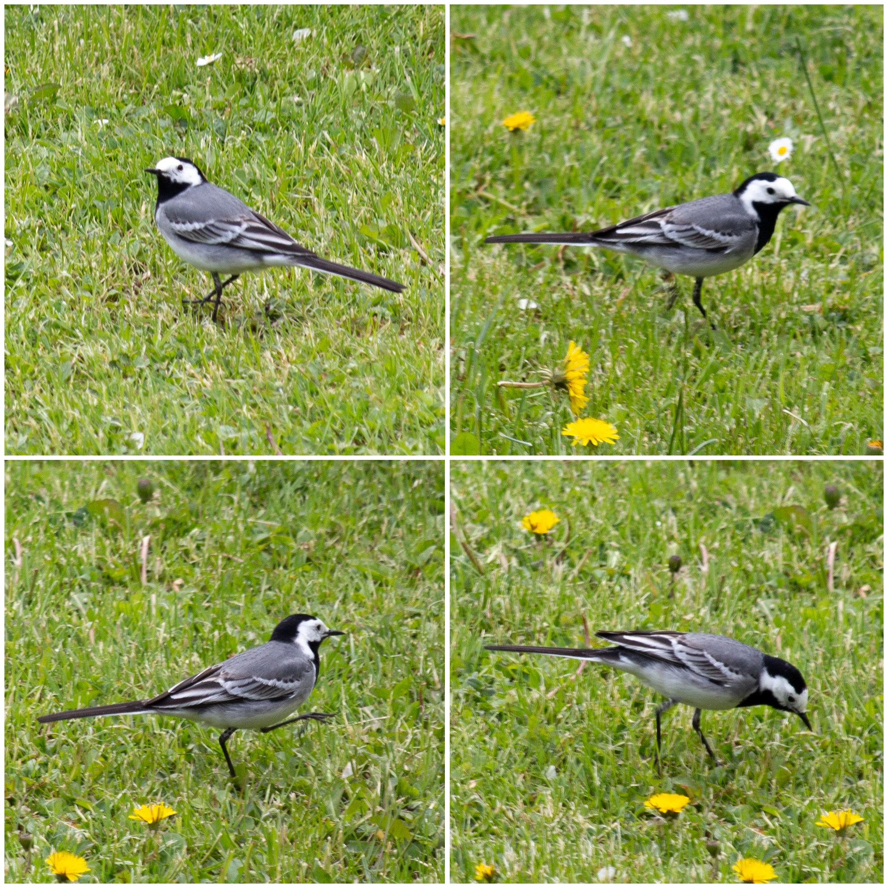

## SharpStitch

SharpStitch is a simple command line tool to stitch images together.

At the moment, works best with same or similar sized images.

*I can't test on a Linux or OSX machine at the moment, so I will only provide a x64 windows binary (see releases). The code should run on other systems as there is no platform specific code here. Ensure you have .NET 8 installed, cd to the src directory and run:*

`dotnet run -- -i C:\Users\Turtle\Desktop\test`

---

**Original usecase**: When I was selling Pokemon cards on CardMarket, I needed a way to quickly stitch two photos of the front and back of the card together into one image. I coudln't find a fast solution to do it automatically to 100 images so I just made this tool.

## Usage examples

### Stitch two images together ( -f )

*Command*: `./SharpStitch.exe -f C:\Users\Turtle\Desktop\cards\front.jpg C:\Users\Turtle\Desktop\cards\back.jpg`

*Produces*: new image front_back.jpg in the same directory.

### Specify output ( -o )

*Command*: `./SharpStitch.exe -f C:\Users\Turtle\Desktop\cards\front.jpg C:\Users\Turtle\Desktop\cards\back.jpg -o C:\Users\Turtle\Desktop\stitched_cards`

*Produces*: new image front_back.jpg in the specified stitched_cards directory.

### Stitch all images in folder ( -i )

*Command*: `./SharpStitch.exe -i C:\Users\Turtle\Desktop\cards`

*Produces*: stitched images in the same folder. Stitches images based on time taken. By default, oldest image will be first, stitched to second oldest. This can be changed with **-m** flag like so. Number of images to be stitched together can be set with **-t** flag.

``./SharpStitch.exe -i C:\Users\Turtle\Desktop\cards -m ByDateNewestToOldest``

``./SharpStitch.exe -i C:\Users\Turtle\Desktop\cards -m ByDateOldestToNewest``

### Take count ( -t )

*Command*: `./SharpStitch.exe -i C:\Users\Turtle\Desktop\cards -t 2`

*Produces*: stitched images in the same folder. Each stitched image will comprise two images. When not provided, all input images will be stitched onto one image unless capped by custom set width and height (-w, -h).

### Rotate images before stitching ( -r )

*Command*: `./SharpStitch.exe -i C:\Users\Turtle\Desktop\cards -r 90`

*Produces*: stitched images in the same folder, rotated by 90 degrees.

### Scale final stitched image ( -s )

*Command*: `./SharpStitch.exe -i C:\Users\Turtle\Desktop\cards -s 0.6`

*Produces*: stitched images in the same folder, scaled down to 60% of original size. To scale up, use number larger than 1. Useful for making smaller sized images.

### Add a border ( -b )

*Command*: `./SharpStitch.exe -i C:\Users\Turtle\Desktop\cards -b 50`

*Produces*: stitched images in the same folder with border all around and between the stitched images. Border size is as provided 50px.

### Use different encoding ( -e )

*Command*: `./SharpStitch.exe -i C:\Users\Turtle\Desktop\cards -e png`

*Produces*: stitched images in the same folder in the png format. Input images must have the png file extension as well.

### Specify grid ( -w, -h, --wh)

*Command*: `./SharpStitch.exe -i C:\Users\Turtle\Desktop\cards -t 4 -w 1 -h 4` *alternatively: --wh 1x4*

*Produces*: stitched images in the same folder. Resulting images will contain 4 source images, stacked in a 1 x 4 grid. When not provided, grid size is calculated - preferring width.

### Multiple options in conjunction

*Command*: `./SharpStitch.exe -i C:\Users\Turtle\Desktop\cards -o C:\Users\Turtle\Desktop\stitched_cards -r 90 -s 0.6 -b 50 -t 2`

## Command line options 
| Option                 | Required | Default              | Description                                                                                                             |
| ---------------------- | -------- | -------------------- | ------------------------------------------------------------------------------------------------------------------------|
|-f, --files             | Yes      |                      | Image files you want stitched together. Images will be stiched in order provided.                                       |
|-i, --input             | Yes      |                      | Input directory. The directory where images to stitch will be searched for. Stitch order method can be changed with -m. |
|-t, --take              |          |                      | Supply the number of images to be stitched together. When not set, all input images will be stitched into one image. Value should be at least 2. |
|-m, --stitchOrderMethod |          | ByDateOldestToNewest | When input directory is provided, the method of selecting which image should be stitched first with another can be changed. When picking by date, time taken EXIF data is used if exists, otherwise, date created is used.  Options: ByDateNewestToOldest - Will pick the newest image first ByDateOldestToNewest - Will pick the oldest image first ByName - Will pick in alphabetical order|
|-o, --output            |          |                      |   Output path. If not provided, stiched image will be placed in the same path as input.                                 |
|-e, --encoding          |          |          jpg         |   Output and input format. Images in input path must be of this file type.                                              |
|-r, --rotate            |          |           0          |   Rotate the images N degrees.                                                                                          |
|-s, --scale             |          |           1          |   Scale the final image. Ex.: 0.5 to scale down 50% or 1.5 to scale up 150%.                                            |
|-b, --borderSize        |          |           0          |   Add a border around the stitched images. Value in pixels.                                                             |
|-w, --gridWidth         |          |           0          |   Number of images to stack vertically (columns). Leave 0 for best guess.                                               |
|-h, --gridHeight        |          |           0          |   Number of images to stack horizontally (rows). Leave 0 for best guess.                                                |
|--wh                    |          |                      |   Alternative way to supply width and height of grid. Format: WxH Ex.: 2x1                                              |
|--help                  |          |                      |   Display this help screen.                                                                                             |
|--version               |          |                      |   Display version information.                                                                                          |
